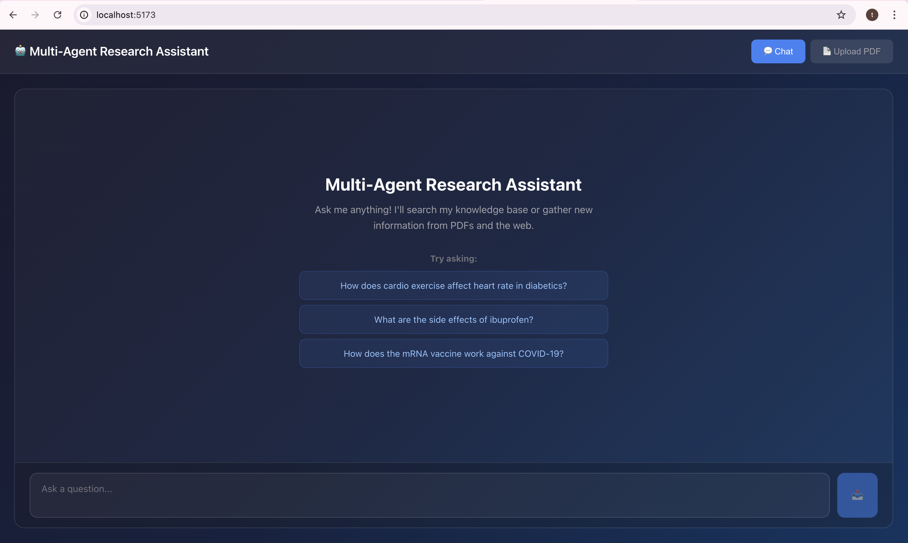
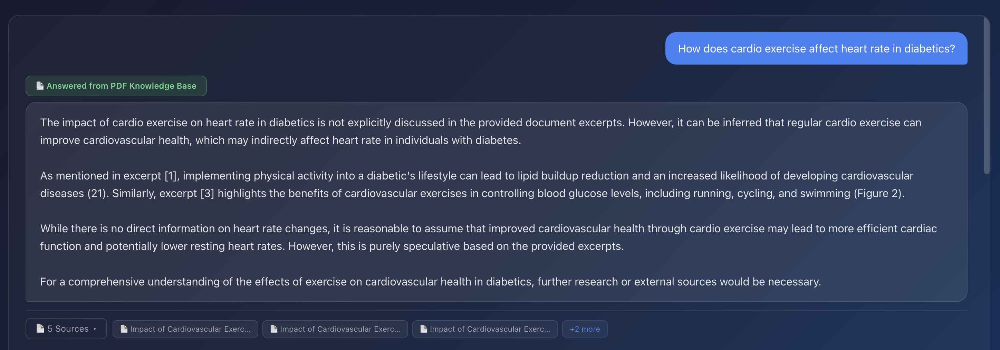
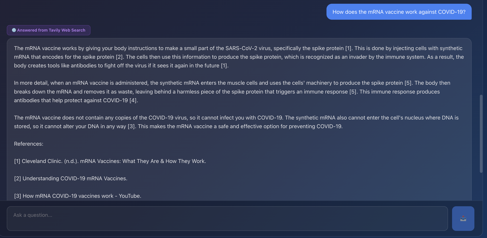

# Multi-Agent Research Assistant 🤖

An intelligent chatbot that answers questions from **PDF documents** or **web search** using a two-agent architecture with LangGraph, Ollama, and MongoDB.



## 🎯 What It Does

Ask any question and the system intelligently decides whether to answer from:
- **📄 PDF Knowledge Base** - Stored research documents about diabetes, exercise, and health
- **🌐 Tavily Web Search** - Real-time web results for topics not in the database

### Example Responses

**Answered from PDF Knowledge Base:**



The system retrieves information from stored diabetes research PDFs, showing a green badge and PDF sources with page numbers.

**Answered from Tavily Web Search:**



When the query isn't covered by PDFs, the system searches the web via Tavily and shows a purple badge with web sources.

## 🏗️ Architecture

Two intelligent agents work together:

1. **Master Agent** - Searches PDF metadata and vector embeddings with relevance scoring
2. **Sub Agent** - Triggered when PDFs don't have relevant content, searches the web via Tavily

Both agents use **Ollama's qwen2.5:7b** model for natural language understanding and **nomic-embed-text** for semantic search.

## 🚀 Tech Stack

**Backend:** Node.js, Express, LangGraph, LangChain, Ollama, MongoDB  
**Frontend:** React, Vite, CSS3  
**AI:** Ollama (qwen2.5:7b + nomic-embed-text)  
**Search:** Tavily API for web results

## ⚡ Quick Start

> **Full setup instructions:** See [SETUP.md](SETUP.md)

**Prerequisites:**
- Node.js v18+
- MongoDB (local or Atlas)
- Ollama with `qwen2.5:7b` and `nomic-embed-text` models
- Tavily API key

**Start the application:**
```bash
# Backend (http://localhost:3001)
cd backend && npm run dev

# Frontend (http://localhost:5173)
cd frontend && npm run dev
```

## 💡 Key Features

**Dual-source intelligence** - PDF documents + web search  
**Smart routing** - Automatically chooses the best source  
**Search method badges** - See whether answer came from PDF or web  
**Relevance scoring** - 0.6 threshold ensures quality results  
**Compact UI** - Expandable source citations  
**Metadata-first** - Fast filtering before vector search  
**Healthcare domain** - Pre-loaded with diabetes research PDFs

## 📡 API Endpoints

| Endpoint | Method | Purpose |
|----------|--------|---------|
| `/api/chat` | POST | Send query, get answer with sources |
| `/api/ingest/pdf` | POST | Upload and process PDF |
| `/api/documents` | GET | List all documents |
| `/api/health` | GET | Server health check |

## 📁 Project Structure

```
kofuku/
├── backend/
│   ├── agents/        # Master & Sub agents (LangGraph)
│   ├── db/            # MongoDB client & vector search
│   ├── services/      # PDF processor, Tavily search
│   ├── prompts/       # AI metadata extraction prompts
│   └── server.js      # Express API server
├── frontend/
│   └── src/
│       ├── components/   # Chat UI, message bubbles
│       └── services/     # API client
└── README.md
```

## 🔧 Configuration

Environment variables (backend `.env`):
```env
OLLAMA_MODEL=qwen2.5:7b
EMBEDDING_MODEL=nomic-embed-text
MONGODB_URI=mongodb://localhost:27017
TAVILY_API_KEY=your_key_here
VECTOR_SEARCH_MODE=local  # or 'atlas' for production
```

See [SETUP.md](SETUP.md) for complete configuration details.

## 📝 Example Queries

Try these questions:

**From PDF (diabetes research):**
- "How does cardio exercise affect heart rate in diabetics?"
- "What are the benefits of physical activity for type 2 diabetes?"

**From Web (via Tavily):**
- "What are the side effects of ibuprofen?"
- "How does the mRNA vaccine work against COVID-19?"

## 🎨 UI Features

- **Dark gradient theme** with glassmorphism effects
- **Search method badges** (green for PDF, purple for web)
- **Compact sources** view with expandable cards
- **Clickable example queries** to get started
- **Responsive design** for mobile and desktop

## 📄 License

MIT

---

**Built with** LangGraph • Ollama • MongoDB • React • Tavily
